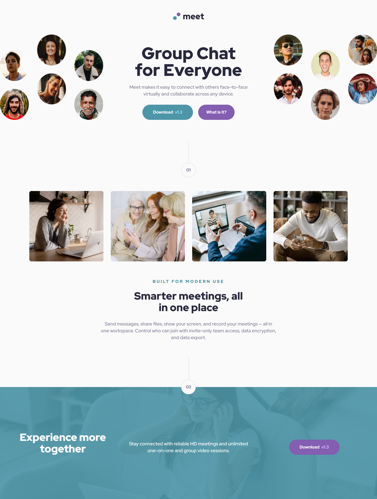

# Frontend Mentor - Meet landing page solution

This is a solution to the [Meet landing page challenge on Frontend Mentor](https://www.frontendmentor.io/challenges/meet-landing-page-rbTDS6OUR). Frontend Mentor challenges help you improve your coding skills by building realistic projects. 

## Table of contents

- [Overview](#overview)
  - [The challenge](#the-challenge)
  - [Screenshot](#screenshot)
  - [Links](#links)
- [My process](#my-process)
  - [Built with](#built-with)
  - [What I learned](#what-i-learned)
  - [Useful resources](#useful-resources)
- [Author](#author)

## Overview

### The challenge

Users should be able to:

- View the optimal layout depending on their device's screen size
- See hover states for interactive elements

### Screenshot

### Links

- Solution URL: [Add solution URL here](https://your-solution-url.com)
- Live Site URL: [Add live site URL here](https://your-live-site-url.com)

## My process

### Built with

- Semantic HTML5 markup
- TailwindCSS
- Flexbox
- CSS Grid
- Mobile-first workflow

### What I learned

:heavy_check_mark: How to actually use TailwindCSS LOL\
:heavy_check_mark: Properly placing HTML elements and styling them based on given design\
:heavy_check_mark: Messing with `tailwind.config.js` to use custom breakpoints, colors, font sies and much more!\
:heavy_check_mark: Making modular classes (buttons and shapes) through `@apply` in `index.css`\
:heavy_check_mark: Building tailwind for production by purging (from 2.89MB to 18KB!)\

### Useful resources

- [Tailwind Docs](https://tailwindcss.com/docs) - Best place to learn tailwind IMO

## Author

- Frontend Mentor - [@GStormx2](https://www.frontendmentor.io/profile/GStormx2)

